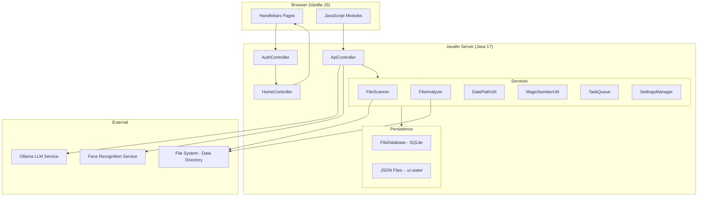
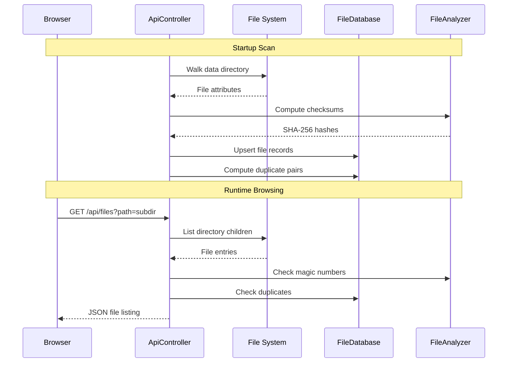
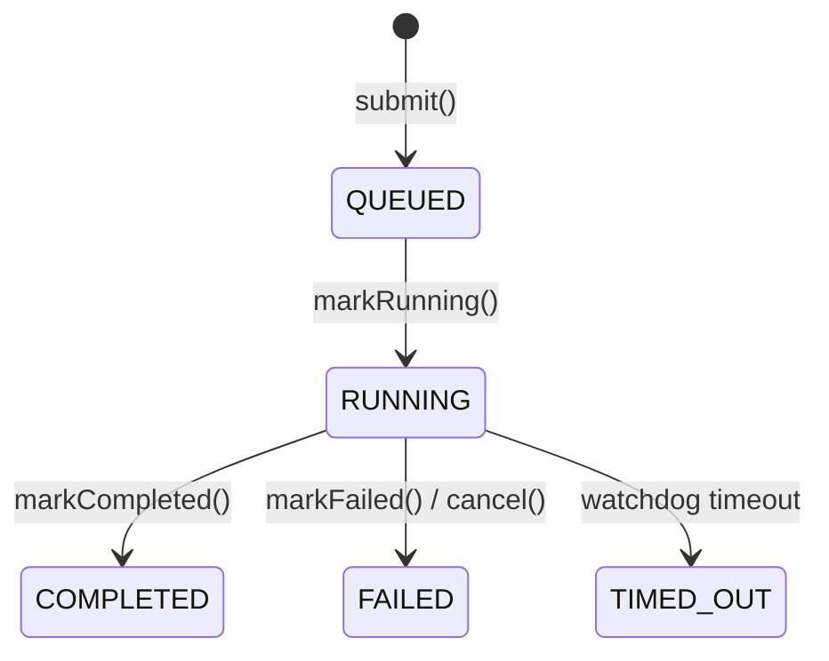

# Design Document: File Management Application

## Overview

The File Management Application is a Java 17 web application built on Javalin 7 that provides a browser-based interface for managing, analyzing, and reorganizing files within a configured data directory. The system uses a server-rendered architecture with Handlebars templates, a REST API layer for dynamic interactions, SQLite for metadata persistence, and vanilla JavaScript for client-side interactivity.

The application follows a monolithic architecture where a single JAR serves both the web UI and API. Data is stored in a combination of SQLite (file metadata, duplicate pairs) and JSON files (connections, job templates, jobs, archive templates, settings, faces). Background tasks run on a thread pool with timeout enforcement.

## Architecture



### Request Flow

1. Browser requests hit Javalin's embedded Jetty server
2. `AuthController.requireAuth` before-handler checks session/cookie for protected routes
3. Page routes render Handlebars templates via `HomeController`
4. API routes (`/api/*`) are handled by `ApiController` and return JSON
5. Static assets (JS, CSS) are served from classpath `/public`

### Data Flow



## Components and Interfaces

### Backend Components

| Component | Responsibility |
|-----------|---------------|
| `App` | Application entry point, Javalin configuration, scheduled tasks |
| `AppConfig` | Properties loading with system property override and placeholder resolution |
| `AuthController` | Login/logout, session management, HMAC-SHA256 cookie signing |
| `HomeController` | Server-side page rendering with Handlebars |
| `ApiController` | REST API endpoints for all CRUD and query operations |
| `FileDatabase` | SQLite schema management, file_info and duplicate_pair CRUD |
| `FileScanner` | Directory walking, checksum computation, stale record cleanup |
| `FileAnalyzer` | Duplicate detection (size-first then SHA-256), directory statistics |
| `DatePathUtil` | YYYY/MM/DD target path computation from file creation dates |
| `MagicNumberUtil` | File signature detection and extension mismatch identification |
| `SettingsManager` | JSON-backed settings persistence with defaults |
| `TaskQueue` | Thread pool executor with timeout watchdog for background tasks |
| `BackgroundTask` | Task state machine (QUEUED → RUNNING → COMPLETED/FAILED/TIMED_OUT) |

### API Endpoints

| Method | Path | Purpose |
|--------|------|---------|
| GET | `/api/files` | List directory children (supports `?path=` and `?connection=`) |
| GET/POST | `/api/files/state` | Load/save expanded tree state per user |
| GET | `/api/files/duplicates` | Get duplicate file groups with metadata |
| GET | `/api/summary` | Directory statistics (counts, sizes, duplicates, estimated reorg time) |
| GET | `/api/scripts/remove-duplicates` | Generate dedup shell script |
| GET | `/api/scripts/reorganize` | Generate reorganization shell script |
| CRUD | `/api/connections` | Connection management (index-based) |
| POST | `/api/connections/{index}/validate` | Validate a connection |
| POST | `/api/connections/check-all` | Health check all active connections |
| CRUD | `/api/job-templates` | Job template management |
| CRUD | `/api/jobs` | Job management with template snapshot |
| CRUD | `/api/archive-templates` | Archive template management |
| GET/PUT | `/api/faces` | Known faces read/update |
| GET/PUT | `/api/settings` | Application settings |
| GET | `/api/db/stats` | SQLite database statistics |
| CRUD | `/api/tasks` | Background task tracking |

### Frontend Modules

| Module | Page | Responsibility |
|--------|------|---------------|
| `app.js` | All | Theme init, sidebar toggle, polling, search |
| `file-tree.js` | Home | Tree rendering, expand/collapse, duplicate overlay |
| `structure.js` | Structure | Virtual tree rendering with move highlighting |
| `connections.js` | Admin | Connection CRUD forms and validation |
| `job-templates.js` | Job Templates | Template CRUD with connection dropdowns |
| `jobs.js` | Jobs | Job creation from templates, status display |
| `faces.js` | Faces | Face list rendering and inline editing |

## Data Models

### SQLite Schema (FileDatabase)

```sql
CREATE TABLE file_info (
    id TEXT PRIMARY KEY,
    relative_path TEXT NOT NULL UNIQUE,
    file_name TEXT NOT NULL,
    file_size INTEGER NOT NULL,
    checksum TEXT,
    created_at TEXT,
    modified_at TEXT,
    target_path TEXT,
    last_scanned TEXT NOT NULL
);

CREATE TABLE duplicate_pair (
    file_id_1 TEXT NOT NULL,
    file_id_2 TEXT NOT NULL,
    PRIMARY KEY (file_id_1, file_id_2),
    FOREIGN KEY (file_id_1) REFERENCES file_info(id),
    FOREIGN KEY (file_id_2) REFERENCES file_info(id)
);
```

### JSON Data Structures (stored in `{data_dir}/.ui-state/`)

**connections.json**
```json
[{
  "name": "string",
  "type": "file|smb|sftp",
  "subPath": "string (file type)",
  "host": "string (smb/sftp)",
  "port": "number (sftp)",
  "username": "string",
  "password": "string (base64 encoded on disk)",
  "active": "boolean",
  "offline": "boolean (set by health check)"
}]
```

**job-templates.json**
```json
[{
  "name": "string",
  "sourceType": "default|connection",
  "sourceConnection": "number (index)",
  "options": { "reorganize": "boolean", "removeDuplicates": "boolean", "sendNotification": "boolean", "email": "string" },
  "targetType": "inPlace|connection",
  "targetConnection": "number (index)"
}]
```

**jobs.json**
```json
[{
  "id": "UUID string",
  "templateSnapshot": { "...template fields..." },
  "status": "created|running|completed|error",
  "sourceOverride": "defaultDataDir|fromConnection (optional)",
  "sourceConnectionName": "string (optional)",
  "targetOverride": "inPlace|toConnection (optional)",
  "targetConnectionName": "string (optional)",
  "createdAt": "ISO-8601",
  "startedAt": "ISO-8601|null",
  "completedAt": "ISO-8601|null",
  "errors": ["string"]
}]
```

**archive-templates.json**
```json
[{
  "name": "string",
  "capacityMb": "number",
  "outputFormat": "tar|imgburn|iso"
}]
```

**settings.json**
```json
{
  "liveMode": "boolean",
  "directoryStructure": "reverse-date",
  "theme": "light|dark",
  "backgroundTaskTimeout": 300,
  "backgroundQueueThreshold": 10,
  "checkConnectionsInterval": 3600,
  "autoRunNextJob": false,
  "maxConcurrentJobs": 1,
  "reorgTransferRateMbps": 100,
  "reorgPerFileOverheadMs": 50
}
```

### FileRecord (Java Record)
```java
public record FileRecord(
    String id,           // UUID
    String relativePath, // path relative to data dir
    String fileName,     // leaf name
    long fileSize,       // bytes
    String checksum,     // SHA-256 hex
    String createdAt,    // ISO-8601
    String modifiedAt,   // ISO-8601
    String targetPath,   // suggested YYYY/MM/DD/filename or null
    String lastScanned   // ISO-8601 scan timestamp
) {}
```

### BackgroundTask State Machine


## Correctness Properties

*A property is a characteristic or behavior that should hold true across all valid executions of a system — essentially, a formal statement about what the system should do. Properties serve as the bridge between human-readable specifications and machine-verifiable correctness guarantees.*

### Property 1: File listing sort order

*For any* directory listing returned by the file browser API, all directory entries SHALL appear before all file entries, and within each group entries SHALL be sorted alphabetically (case-insensitive) by name.

**Validates: Requirements 1.1**

### Property 2: Expand/collapse state round-trip

*For any* list of expanded paths saved via the state API, loading the state for the same user SHALL return an equivalent list.

**Validates: Requirements 1.3**

### Property 3: Magic number mismatch detection

*For any* file whose first bytes match a known magic number signature, if the file's extension does not match the expected extensions for that signature, `MagicNumberUtil.hasMismatch` SHALL return true.

**Validates: Requirements 1.10**

### Property 4: Target path suggestion consistency

*For any* file not in its correct date-based path, the file listing API SHALL include a `suggestedPath` field equal to `DatePathUtil.targetPath(file)`.

**Validates: Requirements 1.11**

### Property 5: Structure preview moved flag

*For any* file in the structure preview, the `moved` flag SHALL be true if and only if the file's current relative path differs from its computed target path.

**Validates: Requirements 2.2**

### Property 6: Structure preview duplicate count

*For any* virtual path in the structure preview where multiple source files resolve to the same target, the `dupCount` field SHALL equal the number of source files mapping to that path.

**Validates: Requirements 2.3**

### Property 7: Summary statistics consistency

*For any* data directory state, the summary API SHALL return `filesAfterDedup` equal to `totalFiles - (totalDuplicateFiles - dupGroupCount)`, and `reclaimableBytes` equal to the sum of `(count - 1) * fileSize` across all duplicate groups.

**Validates: Requirements 3.1**

### Property 7b: Reorganization time estimate correctness

*For any* set of files needing reorganization with known sizes, and given configured `reorgTransferRateMbps` and `reorgPerFileOverheadMs`, the estimated reorganization time SHALL equal the sum of `(fileSize / (transferRateMbps * 1024 * 1024))` for each file, plus `(fileCount * perFileOverheadMs / 1000)`, expressed in seconds.

**Validates: Requirements 3.4, 3.5**

### Property 8: Connection CRUD round-trip

*For any* connection of type File, SMB, or SFTP with valid fields, creating the connection and then reading it back SHALL return equivalent data (with passwords base64-encoded on disk and decoded on read).

**Validates: Requirements 4.1, 4.2, 4.3, 4.4**

### Property 9: File connection validation

*For any* File-type connection, validation SHALL return true if and only if the subdirectory exists within the Data_Directory.

**Validates: Requirements 4.6**

### Property 10: Connection health check state transitions

*For any* active connection, after a health check: if the connection is unreachable it SHALL be marked offline, and if a previously offline connection is now reachable it SHALL have its offline flag removed.

**Validates: Requirements 4.9, 4.10**

### Property 11: Job Template CRUD round-trip

*For any* job template with name, source type, options, and target fields, creating then reading SHALL return equivalent data.

**Validates: Requirements 5.1, 5.2**

### Property 12: Job template snapshot immutability

*For any* job created from a template, the job's `templateSnapshot` SHALL equal the template's state at creation time, and subsequent modifications to the template SHALL NOT affect the job's snapshot.

**Validates: Requirements 6.1**

### Property 13: Job status invariant

*For any* job, its status SHALL be one of: created, running, completed, or error.

**Validates: Requirements 6.3**

### Property 14: Job ordering

*For any* list of jobs returned by the API, they SHALL be ordered by creation time descending (newest first).

**Validates: Requirements 6.5**

### Property 15: Job UUID uniqueness

*For any* set of jobs, all job IDs SHALL be valid UUIDs and no two jobs SHALL share the same ID.

**Validates: Requirements 6.6**

### Property 16: Archive Template CRUD round-trip

*For any* archive template with name, capacity, and output format, creating then reading SHALL return equivalent data.

**Validates: Requirements 7.1, 7.2**

### Property 17: Face edit preserves embeddings

*For any* face entry edit operation, the embedding field in the stored data SHALL remain identical to its value before the edit.

**Validates: Requirements 8.2**

### Property 18: Cookie signing round-trip

*For any* username and valid expiry, signing a cookie payload and then validating it SHALL return the original username.

**Validates: Requirements 9.4, 9.7**

### Property 19: Invalid cookie rejection

*For any* cookie with a tampered signature or expired timestamp, validation SHALL return null (reject the cookie).

**Validates: Requirements 9.5**

### Property 20: Constant-time comparison correctness

*For any* two strings, the constant-time comparison function SHALL return true if and only if the strings are character-by-character identical.

**Validates: Requirements 9.8**

### Property 21: Settings persistence round-trip

*For any* map of settings key-value pairs, setting them via SettingsManager and then reading them back SHALL return equivalent values.

**Validates: Requirements 10.6**

### Property 22: Search filtering correctness

*For any* search query and dataset, all returned results SHALL contain the query string (case-insensitive) in at least one field value.

**Validates: Requirements 11.1**

### Property 23: Active task list consistency

*For any* task with status QUEUED or RUNNING, it SHALL appear in the active tasks list. Tasks with status COMPLETED, FAILED, or TIMED_OUT SHALL NOT appear in the active tasks list.

**Validates: Requirements 12.2**

### Property 24: Task completion timestamp

*For any* task that transitions to COMPLETED or FAILED status, its `completedAt` field SHALL be non-null and represent the time of completion.

**Validates: Requirements 12.3**

### Property 25: Completed-since filtering

*For any* timestamp T and set of tasks, `getCompletedSince(T)` SHALL return only tasks whose `completedAt` is after T.

**Validates: Requirements 12.4**

### Property 26: File scan populates database

*For any* data directory containing files, after a scan completes, every regular file in the directory (excluding .ui-state) SHALL have a corresponding record in the database with matching relative path.

**Validates: Requirements 13.9**

### Property 27: Duplicate detection by checksum

*For any* set of files, two files SHALL be in the same duplicate group if and only if they have identical SHA-256 checksums.

**Validates: Requirements 14.1**

### Property 28: Duplicate group wasted bytes

*For any* duplicate group with N files of size S, the wasted bytes SHALL equal (N - 1) * S.

**Validates: Requirements 14.2**

### Property 29: Remove-duplicates script correctness

*For any* duplicate group, the generated script SHALL keep exactly one file (the first) and remove all others in the group.

**Validates: Requirements 14.3, 3.2**

### Property 30: DatePathUtil target path format

*For any* file with a creation date, `DatePathUtil.targetPath(file)` SHALL return a string matching the pattern `YYYY/MM/DD/filename` where YYYY, MM, DD correspond to the file's creation date.

**Validates: Requirements 15.1**

### Property 31: DatePathUtil consistency (round-trip)

*For any* file, if its relative path equals `DatePathUtil.targetPath(file)`, then `DatePathUtil.isInCorrectDatePath(relativePath, file)` SHALL return true. Conversely, if the relative path differs from the target path, it SHALL return false.

**Validates: Requirements 15.4, 15.2**

### Property 32: Reorganize script correctness

*For any* file not in its correct target path, the generated reorganize script SHALL contain a `mkdir -p` command for the target directory and a `mv` command moving the file to its target path.

**Validates: Requirements 15.3, 3.3**

### Property 33: Job source/target override persistence

*For any* job with source and/or target overrides applied, reading the job back SHALL return the override values unchanged, and the original templateSnapshot SHALL remain unmodified.

**Validates: Requirements 6.2**

### Property 34: Auto-run respects concurrency limit

*For any* set of jobs where auto-run is enabled with max concurrent N, the number of jobs in "running" status SHALL never exceed N after an auto-start cycle.

**Validates: Requirements 6.9, 6.10**

## Error Handling

### Authentication Errors
- Invalid credentials: render login page with error message, retain username
- Expired/tampered cookie: clear cookie, redirect to `/login`
- Unauthenticated access to protected route: redirect to `/login`

### File System Errors
- Missing data directory: create it automatically, return empty listing
- Unreadable files during scan: skip and continue (log warning)
- Path traversal attempts: return HTTP 403 Forbidden

### Connection Errors
- Unreachable SMB/SFTP host: mark connection offline, return offline notice in API
- Invalid File connection path: mark offline, return notice
- Connection outside data directory: return HTTP 403

### Database Errors
- SQLite failures: log error, return empty results or error JSON
- Schema initialization failure: log and continue (degraded mode)

### Background Task Errors
- Task exception: mark as FAILED with error message
- Task timeout: mark as TIMED_OUT, cancel future
- Thread pool exhaustion: tasks queue until a thread is available

### API Errors
- Invalid index parameters: return HTTP 404
- Missing required fields: return HTTP 400
- JSON parse errors: Javalin returns HTTP 400 automatically

## Testing Strategy

### Unit Tests
- `DatePathUtil`: test specific date formats, edge cases (leap years, timezone boundaries)
- `MagicNumberUtil`: test known file signatures, files with no extension, empty files
- `AuthController` cookie signing: test specific payloads, expiry edge cases
- `SettingsManager`: test defaults, persistence, concurrent access
- `FileRecord`: test record equality and field access

### Property-Based Tests

**Library**: [jqwik](https://jqwik.net/) — the standard property-based testing library for Java

**Configuration**: Each property test runs a minimum of 100 iterations.

**Tag format**: Each test is annotated with a comment:
`// Feature: file-management-app, Property N: <property title>`

**Properties to implement**:
- Property 1 (sort order): Generate random file/directory name lists, verify sort invariant
- Property 2 (state round-trip): Generate random path lists, save and load, verify equality
- Property 3 (magic number): Generate byte arrays matching known signatures with wrong extensions
- Property 5 (moved flag): Generate files with random paths and creation dates, verify moved flag logic
- Property 8 (connection round-trip): Generate random connection objects, verify CRUD round-trip
- Property 11 (job template round-trip): Generate random templates, verify CRUD round-trip
- Property 12 (snapshot immutability): Create job, modify template, verify snapshot unchanged
- Property 15 (UUID uniqueness): Create N jobs, verify all IDs are unique valid UUIDs
- Property 17 (face edit preserves embeddings): Generate face entries, edit name fields, verify embedding unchanged
- Property 18 (cookie round-trip): Generate random usernames, sign and validate cookies
- Property 19 (invalid cookie rejection): Generate cookies with tampered signatures or past expiry
- Property 20 (constant-time comparison): Generate random string pairs, verify correctness
- Property 21 (settings round-trip): Generate random key-value maps, verify persistence
- Property 22 (search filtering): Generate datasets and queries, verify all results match
- Property 25 (completed-since): Generate tasks with various timestamps, verify filtering
- Property 27 (duplicate detection): Generate file sets with known checksums, verify grouping
- Property 28 (wasted bytes): Generate duplicate groups, verify calculation
- Property 30 (target path format): Generate files with known creation dates, verify path format
- Property 31 (DatePathUtil consistency): Generate paths equal to target path, verify isInCorrectDatePath returns true
- Property 7b (reorg time estimate): Generate file sets with known sizes, verify time calculation formula

### Integration Tests
- Full request cycle: login → browse → expand → verify state persistence
- Connection lifecycle: create → validate → activate → health check → offline/restore
- Job lifecycle: create template → create job → verify snapshot → update status
- Scan lifecycle: populate directory → scan → verify database records → remove file → rescan → verify stale removal
